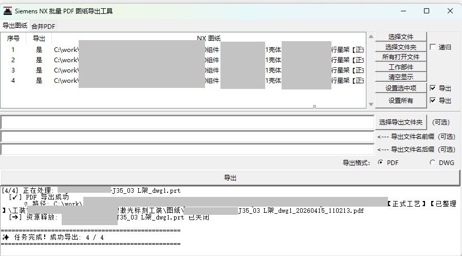
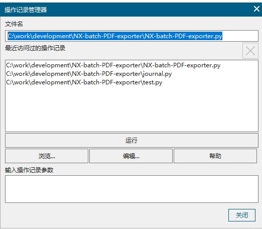
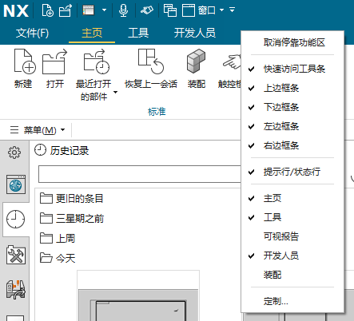
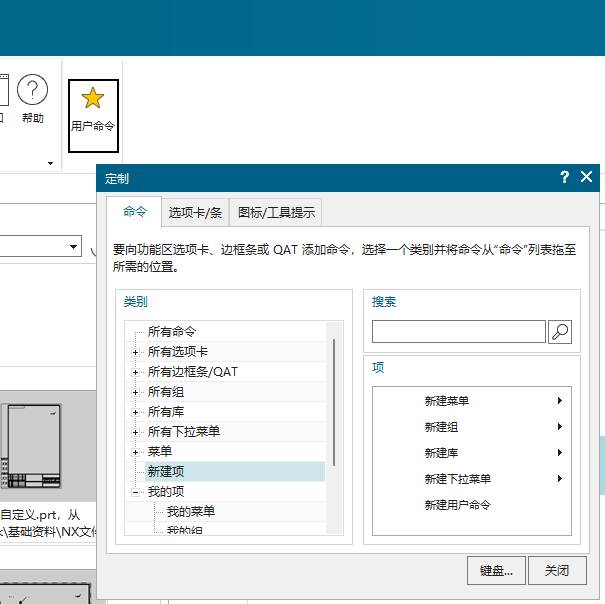
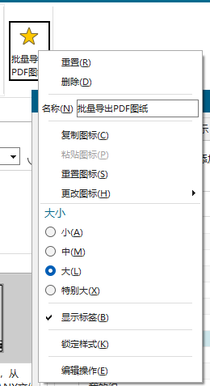
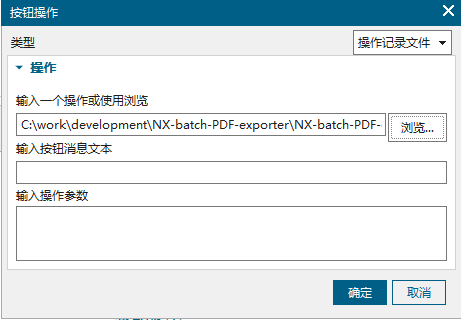
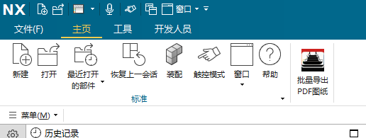

# NX-batch-PDF-exporter【Siemens NX 批量 PDF 图纸导出工具】

2025/11/30  
本工具是用于批量导出 Siemens NX 图纸到 PDF 文件的，可以多选图纸文件，工具依次导出 PDF。  
本来计划是上周写好的，当时初步拟定了框架，结果上周五、周六去出差了，回来也不想写了。这周我又沉迷于看动漫去了，下班时间都花完了，今天星期天又想起来，现在晚上十点多点，基本功能应该是可以用了。我也不知道会不会有隐藏的 bug，只有后面使用中测试了，有问题就再改。  
  

## 功能说明

* 选择要导出的目标图纸：①选择文件：可以多选图纸文件；②选择文件夹：指定文件夹后会过滤出 .prt 图纸文件，如果勾选了递归，则还会额外去子目录中过滤图纸文件；③显示文件：获取当前 NX 中已经打开的 .prt 文件；④清空显示：删除视图中显示的图纸列表。不清空的情况下，新添加图纸会不断累加在视图中，以实现同时多选不同文件夹中的图纸一起导出。同时还会做去重处理，重复选择到同一个文件，视图中只会显示一个。  
* 批量设置状态：左侧视图中可以通过按住`Shift`连选或`Ctrl`多选，点击“设置选中项”，就可以设置选中图纸的导出状态。勾选了导出则设为导出状态，没勾选就设置为不导出。“设置所有”则是把所有显示的图纸导出状态设置为右侧勾选的状态。  
* 导出相关：①导出文件夹：留空则导出到每个 .prt 所在的文件夹，指定时则导出到指定的文件夹。②前缀和后缀：前缀会添加到 PDF 文件名的开头，后缀会添加到 PDF 文件名的结尾。④点击“导出”会开始执行。

## 测试环境

* Siemens NX 2506
* 内置 Python 版本：3.12.8  

## 使用方法

### 方式一

按`Alt`+`F8`打开“操作记录管理器”，浏览本工具中“NX-batch-PDF-exporter.py”所在路径，点击运行即可  

### 方式二

在菜单栏空白处右键，点击“定制”  
  

在命令选项卡下，左侧点新建项，右边点击新建用户命令拖动到菜单栏上  
  

在新建的图标上右键，可以设置名称，再点击最下面编辑操作  
  

浏览 “NX-batch-PDF-exporter.py” 所在路径即可  
  

现在可以通过直接点击图标运行了  
